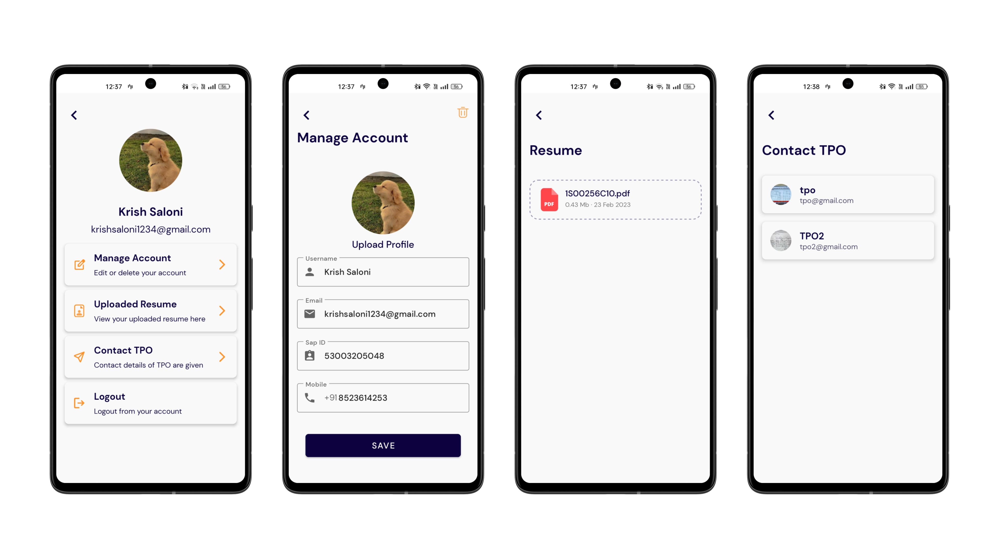

<h1 align="center"> JobSpot 👜 </h1>
<p align="center"> JobSpot is an android application designed to help students find job opportunities and prepare for them. The app offers a range of features to help students apply for jobs, take mock tests, and stay updated on their application status. </p>

## Features

- **Job search**: The app allows students to search for job opportunities based on their preferences and qualifications.
- **Mock tests**: Students can take mock tests to prepare for the job selection process and improve their chances of getting hired.
- **Application tracking**: The app enables students to stay updated on the status of their job applications, including interview schedules and application status.
- **Notifications**: Students receive real-time notifications about new job openings, test results, and application status updates.
- **User-friendly interface**: The app has a simple and intuitive interface that makes it easy for students to navigate and use.

## Tech stack & Open-source libraries

- Minimum SDK level 27
- [Kotlin](https://kotlinlang.org/) based
- [Firebase](https://firebase.google.com/) - It provide backend services for the app. It has realtime database, auth, storage, and more.
- [Coil](https://coil-kt.github.io/coil/compose/) - An image loading library for Android backed by Kotlin Coroutines.
- [Material-Components](https://github.com/material-components/material-components-android) - Material design components for building ripple animation, and CardView.
- [Circular Image View](https://github.com/hdodenhof/CircleImageView) - A fast circular ImageView perfect for profile images.
- [Lottie Animation](https://github.com/airbnb/lottie-android) - Lottie is a mobile library for Android and iOS that parses Adobe After Effects animations exported as json with Bodymovin and renders them natively on mobile!
- [Splash Screen](https://developer.android.com/develop/ui/views/launch/splash-screen/) - The SplashScreen API enables a new app launch animation for all apps when running on a device with Android 12 or higher.
- [ViewPager2](https://developer.android.com/guide/navigation/navigation-swipe-view-2) - Swipe views allow you to navigate between sibling screens, such as tabs, with a horizontal finger gesture, or swipe.
- [ImagePicker](https://github.com/Dhaval2404/ImagePicker) - Easy to use and configurable library to Pick an image from the Gallery or Capture image using Camera.
- [PowerSpinner](https://github.com/skydoves/PowerSpinner) - A lightweight dropdown popup spinner, fully customizable with an arrow and animations for Android.
- [SmoothBottomBar](https://github.com/ibrahimsn98/SmoothBottomBar) - A lightweight Android material bottom navigation bar library.

## Flow
<table border="1">
  <tr>
    <td align="center"> 
      
    </td>
  </tr>
</table>

## Installation Guide

- Clone the repository by running the following command in your terminal:

```bash
 git clone https://github.com/Krish-Parekh/JobSpot.git
```

- Add the `google-service.json` file to your application. This file contains your Firebase project's configuration details and is required for your app to function properly. To get this file, follow these steps:

  - Go to the Firebase console and select your project.
  - Navigate to the project settings and select the "General" tab.
  - Scroll down to the section titled "Your apps" and select the Android app you've already created.
  - Click on the "Download google-services.json" button to download the file.
  - Copy the downloaded file into the `app` directory of your cloned repository.

- Build the app by running the following command in your terminal:

```bash
./gradlew build
```

This command will download any required dependencies, build the app, and generate an APK file.

- Run unit tests by running the following command in your terminal:

```bash
./gradlew test
```

This command will execute all unit tests defined in the project.

- Run the app by running the following command in your terminal:

```bash
./gradlew installDebug
```

This command will install the app on your connected Android device or emulator and launch it.

Congratulations 🎉, you've successfully installed and launched the app and run unit tests!

## Preview
| Login Signup Screen | Add Details Screen |
| --- | --- |
|  |  |

| Home Notification Screen | Job Screen |
| --- | --- |
|  |  |

| Mock Test Screen | Mock Test Question Screen |
| --- | --- |
|  |  |

| Profile Edit Screen | Logout Delete Screen |
| --- | --- |
|  |  |

# Contributing to [JobSpot](https://github.com/Krish-Parekh/JobSpot)

Thank you for your interest in contributing to [JobSpot](https://github.com/Krish-Parekh/JobSpot)! We welcome contributions from anyone, regardless of their level of experience or expertise. This document outlines how to get started with contributing to the project.

## Prerequisites

Before you start, you will need to have the following tools and software installed:

- [Git](https://git-scm.com/downloads)
- [Android Studio](https://developer.android.com/studio)
- [Firebase](https://firebase.google.com/docs/android/setup)
- [Kotlin](https://kotlinlang.org/docs/home.html)

To contribute to [project name], follow these steps:

- Fork the project repository by clicking the "Fork" button on the top-right corner of the GitHub page.
- Clone the forked repository to your local machine using Git:
  ```bash
    git clone https://github.com/[your-github-username]/[project-name].git
  ```
- Create a new branch for your changes:
  ```bash
    git checkout -b [your-branch-name]
  ```
- Open the project in Android Studio.
- Make the necessary changes to the code and commit your changes using Git:
  ```bash
    git add .
    git commit -m "Your commit message here"
  ```
- Push your changes to your forked repository:
  ```bash
    git push origin [your-branch-name]
  ```
- Create a pull request by clicking the "New pull request" button on the top-right corner of the GitHub page.

## Code Style

Please follow the existing code style of the project when making changes. We use [Kotlin style guide](https://developer.android.com/kotlin/style-guide).

## Testing

Make sure to test your changes thoroughly before submitting a pull request. You can run the unit tests using the following command:

    ./gradlew test

## Reporting Bugs

If you find any bugs or issues with the project, please report them by opening a new issue on the GitHub repository.
